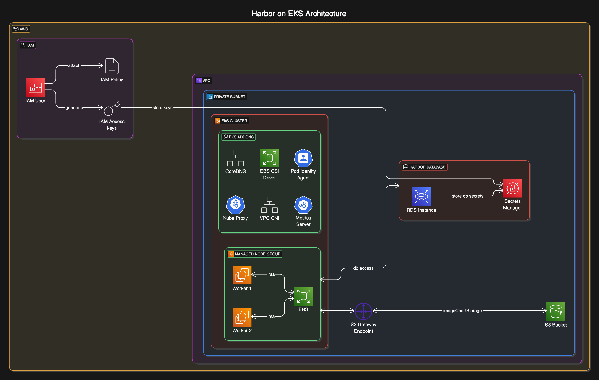

# Terraform Config for Harbor

## Requirements

| Name | Version |
|------|---------|
|  [terraform](#requirement\_terraform) | 1.9.3 |
|  [aws](#requirement\_aws) | ~> 5 |
|  [helm](#requirement\_helm) | 2.17.0 |
|  [kubectl](#requirement\_kubectl) | 1.19.0 |
|  [pgp](#requirement\_pgp) | 0.2.4 |
|  [random](#requirement\_random) | 3.7.1 |

## Providers

| Name | Version |
|------|---------|
|  [aws](#provider\_aws) | 5.91.0 |
|  [kubectl](#provider\_kubectl) | 1.19.0 |
|  [pgp](#provider\_pgp) | 0.2.4 |
|  [random](#provider\_random) | 3.7.1 |

## Modules

| Name | Source | Version |
|------|--------|---------|
|  [ebs\_csi\_driver\_irsa](#module\_ebs\_csi\_driver\_irsa) | terraform-aws-modules/iam/aws//modules/iam-role-for-service-accounts-eks | ~> 5.30 |
|  [eks](#module\_eks) | terraform-aws-modules/eks/aws | ~> 20.31 |
|  [eks\_blueprints\_addon](#module\_eks\_blueprints\_addon) | aws-ia/eks-blueprints-addon/aws | 1.1.1 |
|  [eks\_blueprints\_addons](#module\_eks\_blueprints\_addons) | aws-ia/eks-blueprints-addons/aws | ~> 1.20.0 |
|  [vpc](#module\_vpc) | terraform-aws-modules/vpc/aws | 5.19.0 |

## Resources

| Name | Type |
|------|------|
| [aws_db_instance.harbor](https://registry.terraform.io/providers/hashicorp/aws/latest/docs/resources/db_instance) | resource |
| [aws_db_subnet_group.harbor_database_subnet_group](https://registry.terraform.io/providers/hashicorp/aws/latest/docs/resources/db_subnet_group) | resource |
| [aws_iam_access_key.harbor](https://registry.terraform.io/providers/hashicorp/aws/latest/docs/resources/iam_access_key) | resource |
| [aws_iam_policy.harbor](https://registry.terraform.io/providers/hashicorp/aws/latest/docs/resources/iam_policy) | resource |
| [aws_iam_user.harbor](https://registry.terraform.io/providers/hashicorp/aws/latest/docs/resources/iam_user) | resource |
| [aws_iam_user_login_profile.harbor](https://registry.terraform.io/providers/hashicorp/aws/latest/docs/resources/iam_user_login_profile) | resource |
| [aws_iam_user_policy_attachment.harbor_admin](https://registry.terraform.io/providers/hashicorp/aws/latest/docs/resources/iam_user_policy_attachment) | resource |
| [aws_iam_user_policy_attachment.harbor_s3_access](https://registry.terraform.io/providers/hashicorp/aws/latest/docs/resources/iam_user_policy_attachment) | resource |
| [aws_s3_bucket.harbor](https://registry.terraform.io/providers/hashicorp/aws/latest/docs/resources/s3_bucket) | resource |
| [aws_secretsmanager_secret.harbor_iam_user_keys](https://registry.terraform.io/providers/hashicorp/aws/latest/docs/resources/secretsmanager_secret) | resource |
| [aws_secretsmanager_secret.harbor_pg_master_connection](https://registry.terraform.io/providers/hashicorp/aws/latest/docs/resources/secretsmanager_secret) | resource |
| [aws_secretsmanager_secret_version.harbor_iam_user_keys](https://registry.terraform.io/providers/hashicorp/aws/latest/docs/resources/secretsmanager_secret_version) | resource |
| [aws_secretsmanager_secret_version.harbor_pg_master_connection](https://registry.terraform.io/providers/hashicorp/aws/latest/docs/resources/secretsmanager_secret_version) | resource |
| [aws_security_group.harbor_database](https://registry.terraform.io/providers/hashicorp/aws/latest/docs/resources/security_group) | resource |
| [aws_vpc_endpoint.s3](https://registry.terraform.io/providers/hashicorp/aws/latest/docs/resources/vpc_endpoint) | resource |
| [kubectl_manifest.cluster_secret_store](https://registry.terraform.io/providers/gavinbunney/kubectl/1.19.0/docs/resources/manifest) | resource |
| [kubectl_manifest.harbor_namespace](https://registry.terraform.io/providers/gavinbunney/kubectl/1.19.0/docs/resources/manifest) | resource |
| [kubectl_manifest.harbor_rds_external_secret](https://registry.terraform.io/providers/gavinbunney/kubectl/1.19.0/docs/resources/manifest) | resource |
| [kubectl_manifest.harbor_s3_external_secret](https://registry.terraform.io/providers/gavinbunney/kubectl/1.19.0/docs/resources/manifest) | resource |
| [pgp_key.harbor](https://registry.terraform.io/providers/ekristen/pgp/0.2.4/docs/resources/key) | resource |
| [random_password.harbor_admin_password](https://registry.terraform.io/providers/hashicorp/random/3.7.1/docs/resources/password) | resource |
| [random_password.master_password](https://registry.terraform.io/providers/hashicorp/random/3.7.1/docs/resources/password) | resource |
| [aws_acm_certificate.wildcard](https://registry.terraform.io/providers/hashicorp/aws/latest/docs/data-sources/acm_certificate) | data source |
| [aws_availability_zones.azs](https://registry.terraform.io/providers/hashicorp/aws/latest/docs/data-sources/availability_zones) | data source |
| [aws_caller_identity.current](https://registry.terraform.io/providers/hashicorp/aws/latest/docs/data-sources/caller_identity) | data source |
| [aws_eks_cluster_auth.cluster_auth](https://registry.terraform.io/providers/hashicorp/aws/latest/docs/data-sources/eks_cluster_auth) | data source |
| [aws_iam_policy.administrator](https://registry.terraform.io/providers/hashicorp/aws/latest/docs/data-sources/iam_policy) | data source |
| [aws_iam_policy_document.harbor_iam_user_policy](https://registry.terraform.io/providers/hashicorp/aws/latest/docs/data-sources/iam_policy_document) | data source |
| [aws_region.current](https://registry.terraform.io/providers/hashicorp/aws/latest/docs/data-sources/region) | data source |
| [aws_route53_zone.bootstrap_domain](https://registry.terraform.io/providers/hashicorp/aws/latest/docs/data-sources/route53_zone) | data source |
| [pgp_decrypt.harbor](https://registry.terraform.io/providers/ekristen/pgp/0.2.4/docs/data-sources/decrypt) | data source |

## Inputs

| Name | Description | Type | Default | Required |
|------|-------------|------|---------|:--------:|
|  [aws\_region](#input\_aws\_region) | The region where the infrastructure should be deployed to | `string` | `"us-east-1"` | no |
|  [db\_engine](#input\_db\_engine) | Harbor RDS DB Engine | `string` | `"postgres"` | no |
|  [db\_engine\_version](#input\_db\_engine\_version) | Harbor RDS DB Engine Version | `string` | `"15.10"` | no |
|  [db\_instance\_storage](#input\_db\_instance\_storage) | DB Instance allocated storage in gibibytes | `number` | `10` | no |
|  [db\_instance\_type](#input\_db\_instance\_type) | RDS DB Instance type for Harbor    Reference: https://docs.aws.amazon.com/AmazonRDS/latest/UserGuide/Concepts.DBInstanceClass.Support.html#gen-purpose-inst-classes | `string` | n/a | yes |
|  [db\_instance\_username](#input\_db\_instance\_username) | RDS DB Instance Username for Harbor | `string` | `"harbor"` | no |
|  [db\_name](#input\_db\_name) | Harbor Database Name | `string` | `"registry"` | no |
|  [deploy\_stage](#input\_deploy\_stage) | The environment short name to use for the deployed resources (for tagging purposes).    Options:   - dev   - staging   - prod    Default: dev | `string` | `"dev"` | no |
|  [enable\_vpc\_endpoint](#input\_enable\_vpc\_endpoint) | Enable S3 VPC Gateway Endpoint | `bool` | `null` | no |
|  [harbor\_bucket](#input\_harbor\_bucket) | Name of the S3 Bucket | `string` | `"harbor-test"` | no |
|  [harbor\_iam\_user](#input\_harbor\_iam\_user) | Harbor IAM User to access S3 Bucket | `string` | `"harbor"` | no |
|  [instance\_type](#input\_instance\_type) | AWS EKS Instance Type for Harbor    Reference: https://goharbor.io/docs/2.12.0/install-config/installation-prereqs/ | `string` | n/a | yes |
|  [private\_subnets](#input\_private\_subnets) | Private Subnets CIDR range | `list(string)` | n/a | yes |
|  [public\_subnets](#input\_public\_subnets) | Public Subnets CIDR range | `list(string)` | n/a | yes |
|  [root\_domain](#input\_root\_domain) | The TLD of the DNS to use for this deployment | `string` | `"ignitescale.com"` | no |
|  [team](#input\_team) | team that owns application (for tagging purposes) | `string` | `"Ak"` | no |
|  [terraform\_gitpath](#input\_terraform\_gitpath) | The location in source control where the terraform directory exists (for tagging purposes) | `string` | `"terraform"` | no |
|  [vpc\_cidr](#input\_vpc\_cidr) | VPC CIDR for EKS Cluster | `string` | n/a | yes |
|  [vpc\_name](#input\_vpc\_name) | VPC Name for EKS Cluster | `string` | n/a | yes |

## Outputs

| Name | Description |
|------|-------------|
|  [eks\_connect](#output\_eks\_connect) | Configure kubectl: make sure you're logged in with the correct AWS profile and run the following command to update your kubeconfig |
|  [harbor\_admin\_password](#output\_harbor\_admin\_password) | Harbor UI Admin Password |
|  [harbor\_iam\_user](#output\_harbor\_iam\_user) | Harbor's IAM User for S3 Access |
|  [harbor\_iam\_user\_secretmanager\_secret](#output\_harbor\_iam\_user\_secretmanager\_secret) | Harbor's IAM User SecretManager Secret ARN |
|  [harbor\_rds\_pg\_master\_connection](#output\_harbor\_rds\_pg\_master\_connection) | Harbor RDS Instance Secret Resource |
|  [harbor\_s3\_bucket](#output\_harbor\_s3\_bucket) | Harbor S3 Bucket |
|  [password\_harbor](#output\_password\_harbor) | Your password for first-time console login |
